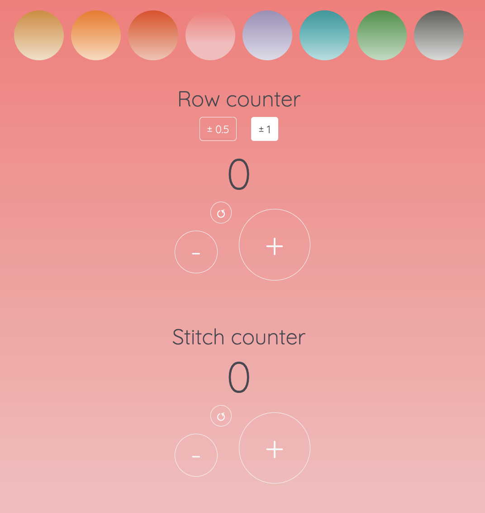

<!-- reference for coming back to the top -->

# Knitting Counter
Try the counter <a href= "https://francesca-pizzighini.github.io/KnittingCounter/">here</a>. 
Or continue reading about the prokect <a href= "#the-project">here</a>.

  
Index

  <ol>
    <li>
      <a href="#the-project">The Project</a>
      <ul>
        <li><a href="#prerequisite">Prerequisite</a></li>
        <li><a href="#technical-requisite">Technical requisite</a></li>
      </ul>
    </li>
    <!-- -->
    <li>
      <a href="#the-idea">The Idea</a>
      <ul>
        <li><a href="#why-knitting">Why knitting?</a></li>
        <li><a href="#design-inspration">Design inspiration</a></li>
      </ul>
    </li>
    <!--  -->
    <li>
      <a href="#coding-languages">Coding languages</a>
    </li>
    <li><a href="#credidt">Credits</a></li>
    <li><a href="#contacts">Contacts</a></li>
  </ol>

## The Project
This counter was designed and developed as the final project to complete the unit "Javascript Basics" in the Front-End Developer Master course offered by <a src="https://www.start2impact.it">Start2Impact University</a>.

<a href="#top">return to the top</a>

### Prerequisite
The assignment to complete this porject was pretty simple: creating an application that allow the user to decrement or increment a value on screen. 
When the user starts the page need to see a button plus to increase, a button minus to decrease and the number 0 as the value of the counter.
Additional features are welcome.

### Technical requisite
To build the application 

## The Idea
This counter was designed and developed as the final project to complete the unit "Javascript Basics" in the Front-End Developer Master course offered by <a src="https://www.start2impact.it">Start2Impact Unimersity</a>.

### Why knitting

### Design Ispiration

## Coding languages

## Credits

## Contacts

